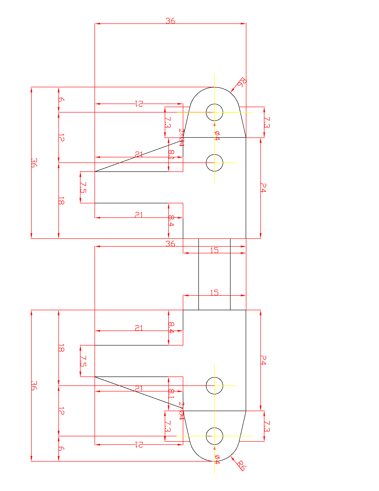
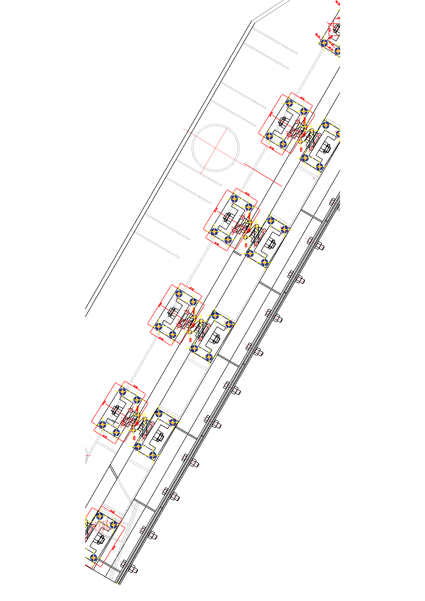

# AutoDim — AutoCAD 2025 自动尺寸标注插件

用 C# / .NET 8 开发的 AutoCAD 2025 插件，自动为工程图生成符合国标惯例的尺寸标注：
总体外形、轮廓分段、孔/圆直径与定位、圆角半径，并自动做布局避让（文字互不压线）。
首个公开 Demo（v0.1.0）。

## 功能

- **总体外形尺寸**：宽/高，尺寸界线落在真实轮廓上（圆弧端头不悬空）
- **轮廓分段尺寸**：水平/垂直边对齐标注，斜边按主投影（GB/T 4458.4，不重复标角度）
- **孔/圆**：直径标注 + 定位尺寸链；重复孔径合并为 `N×Ød` 注记（同尺寸孔标一个 Ø + 数量）
- **圆角/圆弧**：半径 R 标注（同一圆只标一次，圆心/半径保真）
- **布局避让**：按文字框判据外推，标注文字互不压、不飞出图纸
- 面向 **SolidWorks / CAD 导出的干净工程图**：保留原始精确坐标，不做破坏性处理；
  扫描碎片图可用 `ADIMCLN` 调整清洗参数

## 效果

test2（SW 导出的对称圆头板件）：**34 个尺寸 + 2 个 N×Ød 注记，文字撞车 0**



复杂扫描件 test.dwg（`ADIMCLN` 调紧参数后）：130 个尺寸 + 64 个注记，文字撞车 0



## 安装

### 方式一：自动加载（推荐）

1. 构建插件（见「编译」）。
2. 运行 `deploy/install.ps1`（把最新 DLL 复制到 AutoCAD 自动加载目录），或手动把
   `deploy/AutoDim.bundle` 复制到 `%APPDATA%\Autodesk\ApplicationPlugins\`，
   并确保 `Contents\` 下有 `AutoDim.dll` 和 `AutoDim.Core.dll`。
3. 重启 AutoCAD，插件自动加载（无需 NETLOAD）。

### 方式二：手动加载

```text
NETLOAD
D:\...\src\AutoDim\bin\x64\Debug\net8.0-windows\AutoDim.dll
```

## 使用

| 命令 | 说明 |
|---|---|
| `ADIMCLEAN` | 一条龙：散线组织成轮廓 → 自动标注（推荐用于导出的工程图） |
| `ADIMALL` | 整图直接标注 |
| `ADIMWIN` / `ADIMSEL` | 框选 / 选中对象标注 |
| `ADIMCOORD` | 任意倾斜多边形：按最左下顶点引 X/Y 坐标 |
| `ADIMCFG` | 标注类别开关（总体/分段/孔）+ 自动清洗开关 |
| `ADIMCLN` | 清洗参数（吸附/合并公差、最短保留长度等）持久化到本图 |
| `ADIMSCALE` | 固定标注比例（0=自动） |

图层：

- `ADIM`（红色）：标注本体
- `ADIM_CENTER`（黄色）：孔中心线
- `ADIM_CLEAN` / `ADIM_CLEAN_L`（灰色，默认关闭）：清洗中间层，仅在调试时打开

## 编译

环境：AutoCAD 2025（程序集 25.0.58）+ .NET 8 SDK。

```bash
bash build.sh            # Debug
bash build.sh Release    # Release
```

产物：`src/AutoDim/bin/x64/Debug/net8.0-windows/AutoDim.dll`（含 AutoDim.Core.dll）

## 测试

```bash
dotnet run --project test/AutoDim.Core.SelfTest   # 几何核心自测
bash test/run-tests.sh                            # 无界面回归（accoreconsole + test.dwg）
```

## 已知限制与路线

- Demo 面向规整/中等复杂零件；多轮廓相交、杂乱线框的复杂装配图鲁棒性待完善
- 对称/阵列特征的 `N×` 合并、国标化排版细节持续打磨中
- 3D(STEP) 与 MLLM 语义理解（识别轮廓/孔/噪声）为远期路线

## License

MIT
